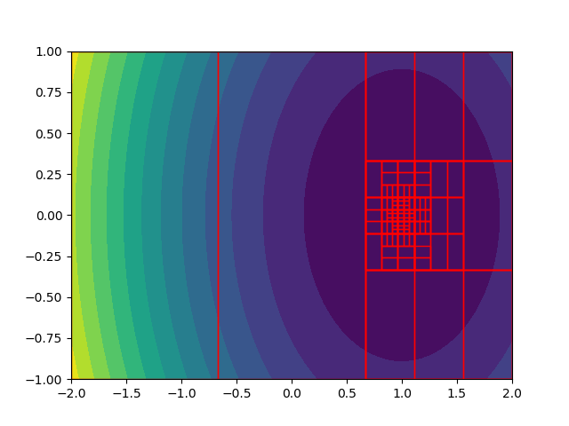

# Численные методы оптимизации
## Двумерная оптимизация
В данной работе реализован метод _"деления на три"_
## Структура проекта
1. Пакет **method** - содержит файлы с реализацией численного метода
   * *IOptimizable.py* - интерфейс для создания необходимого API
   * *divisionByThree.py* - реализация алгоритма _деления на три_
2. Пакет **main** - содержит файл с кодом приложения, демонстрирующего работу численного метода
3. Пакет **helpers** - вспомогательные структуры для реализации метода
    * *TPoint.py* - хранение координат точки на плоскости
    * *TRectangle* - структура для хранения прямоугольника и его свойств
## Пример работы программы (анимация)

